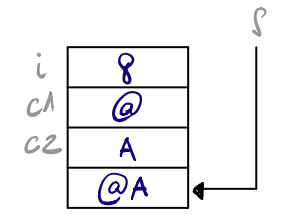
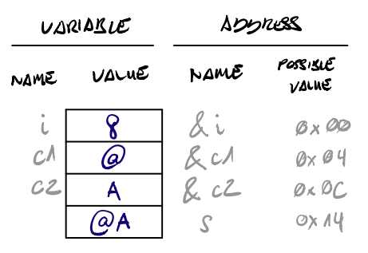
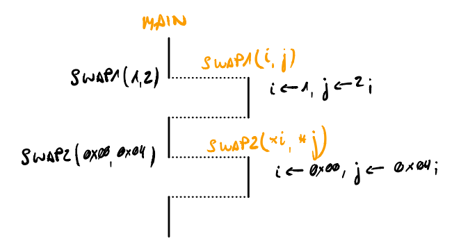
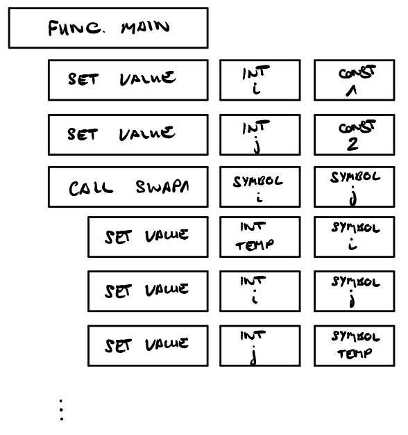
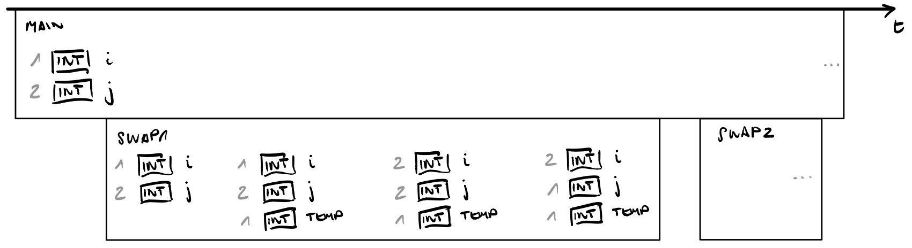

# SOP - Alain Schaller - 16-896-375

# Memory - Control flow - Git


## 2. Memory

> Draw the [memory content](https://unifr.coursc.ch/#memory-representation) of the following program at the end of line 4 (assuming a 32-bit architecture)

```c
int main() {
    int i=8;
    char c1='@';
    char c2='A';
    char s[5]="@A";
}
```


### 2.1. with symbolic names and values of the variables

> (cf. [Fig. 7](https://unifr.coursc.ch/#memory-representation))

{ width=150px }


### 2.2. same as 2.1., but augmented with symbolic names and possible hexadecimal values of the addresses

> (cf. [Fig. 6](https://unifr.coursc.ch/#memory-representation))

{ width=200px }


### 2.3. big and little endian, with symbolic memory cell and address values

> (cf. [Fig. 5](https://unifr.coursc.ch/#endianess))

{ width=100% }


### 2.4. big and little endian, with hexadecimal memory cell and address values

> (cf. [Fig. 4](https://unifr.coursc.ch/#endianess))

{ width=100% }


## 3. Control Flow & Abstract Syntax Tree

```c
void swap1(int i, int j) {
    int temp;
    temp = i;
    i = j;
    j = temp;
}
void swap2(int *i, int *j){
    int temp;
    temp = *i;
    *i = *j;
    *j = temp;
}
int main(){
    int i;
    int j;
    i=1; j=2;
    swap1(i,j);
    swap2(&i,&j);
}
```

### 3.1. draw the [control flow](https://unifr.coursc.ch/#control-flow) for the function calls main() and swap1(i,j)

{ width=350px }

### 3.2. draw the [associated AST](https://unifr.coursc.ch/#compilateur), including the [call stack](https://unifr.coursc.ch/#pile-execution)

> just before `swap1` returns to its caller function main

> – ignore the function call `swap2(&i, &j)`.

The fact that we have a new variable and operations into the `swap1` method, I wasn't
sure how to represent it into the `Abstract Syntax Tree`.

{ width=350px }

{ width=100% }


## 4. Macros and C Preprocessor

### 4.1. Test the following scenario on machine and explain the output

> **Hint:** Explain what is wrong with the macro 'square' and write a correct version.


```c
#define max(A, B) ((A) > (B) ? (A) : (B))
#define square(x) x * x
```

```c
max(a, b);
```

This will produce the desired terinary operation and give the max value.


```c
max(a+1, b+1);
```

Again, will return the greatest value between `a+1` and `b+1`; **with the `+1`**.


```c
square(x);
```

Will square the given value `x`.

```c
square(x+1);
```

As the macro will be preprocessed by the compile and lets say, _copy-pasted_ into the
code, by doing ourselves, we can see that we will get an operation problem, as `1 * x`
will be computed first and result in `x + (1 * x) + 1 = x + x + 1 = 2 * x + 1`.


### 4.2. Write a macro swap(t,x,y) that exchanges the values of the two variables

> Write a macro swap(t,x,y) that exchanges the values of the two variables:
> * `x` and `y` assuming that both are of type `t`
>   * e.g. `int`, and test it on machine.

> **Hint:** Use a block structure and test your macro with the program:


A naive way to implement this is by declaring a new temporary variable, but,
in case we call the macro multiple times in the same context, we might
get an issue, as the declared variable will already be present in the context.

```c
#include <stdio.h>
#define swap(t,x,y) t tmp_swap = x; x = y; y = tmp_swap;
int main() {
    int a=1;
    int b=2;
    swap(int,a,b);
    printf("%d %d\n", a, b);
}
```


### 4.3. `swap` macro continue

> (tricky) If you found a working solution for your macro swap(t,x,y) in the previous exercise, this solution will probably not work in the following situation:

```c
if (a>b) swap(int,a,b); /* whoops */
else a = b;
```

> Why? Hint: write down the code of line (1) once the macro has been expanded, and you will see the problem (if not, compile your code and understand the compiler’s complaint).

It won't compile are, are the expansion of the macro, we won't have
the correct operation tree of a condition without curly braces, as the body
of `if`, without curly braces, accept only a single operation.

However, here we place 3 operations like so:

```c
if (a>b)
    int tmp_swap = a;
    a = b;
    b = tmp_swap;
else a = b;
```


> Adapt the code of your macro in order that the above lines (1)-(2) become a correct C statement. Hint: the solution is tricky ! Nevertheless, try to find a solution by your own, e.g. without “google search”..

Taking inspiration on the following exercise, with the _debug_ macro, we can
enclose the swap operation in a `do while` loop like so:

```c
#include <stdio.h>
#define swap(t,x,y) do { t tmp_swap = x; x=y; y=tmp_swap; } while(0)
int main() {
    int a=1;
    int b=2;
    swap(int,a,b);
    if (a>b) swap(int,a,b);
    else a = b;
    printf("%d %d\n", a, b);
}
```


### 4.4. More macros

> (tricky) A common approach to generating a single source code that is suitable for both development and release is done with the help of the following macro:

```c
#ifdef DEBUG
# define DEBUG_PRINT(x) printf x
#else
# define DEBUG_PRINT(x) do {} while (0)
#endif
```

> Use it like:

```c
DEBUG_PRINT(("var1: %d; var2: %d; str: %s\n", var1, var2, str));
```

> Write a little program to test it.


```c
int main (int argc, char* argv[]) {
    for (int i = 0; i < argc; i++) {
        DEBUG_PRINT(("argument[%d]: %s", i, arv[i]));
    }

    // Do work
}
```


<!-- > Note: the program must be compiled with the -D option to define DEBUG:

```shell
$ gcc -D DEBUG prog.c -o prog
``` -->


## 5. Make


hello.c:

```c
void tellMe(void);
int main () {tellMe();}
```

tellMe.c:

```c
#include <stdio.h>
void tellMe () {printf("hello\n");}
```

Makefile:

```Makefile
hello : hello.o tellMe.o
    gcc -o hello hello.o tellMe.o
hello.o : hello.c
    gcc -c hello.c
tellMe.o : tellMe.c
    gcc -c tellMe.c
```

> and we consider the following scenario:


```shell
$ make # (1)
$ touch tellMe.c # or modify tellMe.c # (2)
$ make tellMe.o # (3)
$ make # (4)
$ make # sic!, redo a make # (5)
$ make -W tellMe.c # (6)
```

### 1. Draw the dependency tree of hello


The <span style="color:yellow">yellow</span> nodes represent the targets,
the <span style="color:green">green</span> nodes represent the prerequisites files
and finally, the <span style="color:gray">gray</span> nodes represent the command executed when the prerequisites have been updated.


### 2. What is the information displayed by the commands (1), (3)-(6)?

> What is the information displayed by the commands (1)?

```
gcc -c hello.c
gcc -c tellMe.c
gcc -o hello hello.o tellMe.o
```

Without any argument, `make` will execute the first _target_ declared in the file.
However, the `hello` _target_ defines dependencies on other _targets_, therefore,
execute those first, which, in the end, will print the different command
executed by the `Makefile`.


> What is the information displayed by the commands (3)-(6)?

```
gcc -c tellMe.c
make: `hello' is up to date.
make: `hello' is up to date.
gcc -c tellMe.c
```

First, after we `touch` the `tellMe.c` file, which will change its `last modified` attribute,
we will compile again the `tellMe.o` _target_, which produce the first
output of `gcc`.

The following 2 `make` command are identical, as it will check if he really needs
to compile its dependencies after a file change, however, there as been
no modification on the `.o` files, which prints this output of `is up to date`.
This will allow the user to avoid compile multiple times if its program are
already up to date with its dependencies/source files.

Finally, with the `-W` option of `make`, as we can read in the manual:

  > Pretend that the target file has just been modified.

This means, `make` will skip the check whether or not the target is up to date, and will execute the `tellMe.c` target and print the command.


## 6. Git & GitLab

> Write a Makefile with the following functions:
>   * Compiles the wcount.c source file to a wcount binary
>   * Runs wcount with counting the wcount.c source file.

```Makefile
all: compile test

compile: wcount.c
	# Compiles the wcount.c source file to a wcount binary
	gcc -o wcount wcount.c

test:
	# Runs wcount with counting the wcount.c source file.
	./wcount < wcount.c
```
